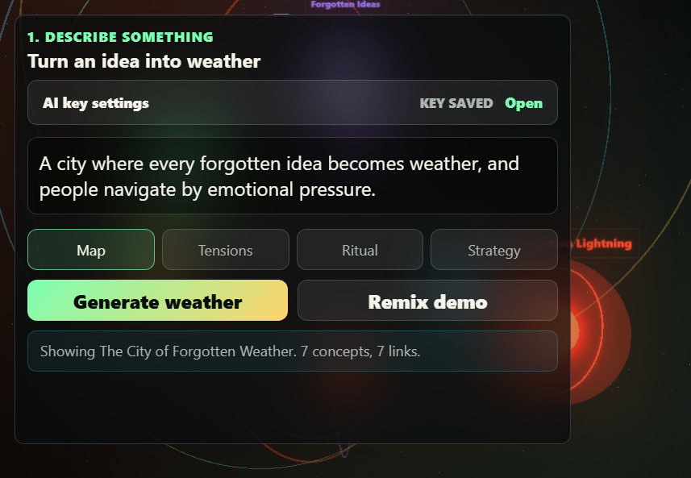

# Mnemonic Weather Engine

Mnemonic Weather Engine is an AI-assisted art prototype for turning a messy idea into a navigable weather system. Instead of treating a prompt as text to summarize, it treats the prompt as an atmosphere: concepts become pressure bodies, relationships become arcs, contradictions become storm fronts, and useful tensions become things you can inspect.

The project is intentionally strange, visual-first, and demo-focused. It is part semantic map, part speculative design instrument, part live mood board for thinking through an idea.

## Screenshots

The main demo view combines a prompt panel, generation modes, live metrics, and the semantic weather canvas.



## Core Concept

Most text tools make ideas flatter: bullets, outlines, summaries, and lists. Mnemonic Weather Engine goes the other direction. It asks what an idea would feel like if it had weather.

The app takes a seed prompt such as:

```text
A city where every forgotten idea becomes weather, and people navigate by emotional pressure.
```

Then it builds a semantic weather map made of:

- concepts: glowing bodies in the field
- relationships: curved currents between concepts
- tensions: instability zones that indicate conflict or pressure
- questions: prompts for further exploration
- motion: pulse, drift, turbulence, and bloom values that shape the feel of the scene

The result is not meant to be a literal diagram. It is meant to be an evocative thinking surface: a place where a designer, writer, strategist, or engineer can see an idea as a system with forces.

## What You Are Looking At

The main canvas is a semantic atmosphere.

In the full 3D mode, the app uses Three.js to render glowing concept nodes, halo fields, relationship arcs, rotating weather fronts, labels, bloom, and atmospheric fog.

In local canvas mode, the app uses a lighter 2D renderer. This mode exists so the demo still responds if the Three.js CDN or browser module loading path fails. It is less sophisticated visually, but it still gives immediate feedback and can use the AI endpoint when a valid key is available.

## Generation Modes

- `Map`: a broad semantic overview of the idea
- `Tensions`: emphasizes contradictions, risks, and unstable dependencies
- `Ritual`: frames the idea as repeatable gestures, ceremonies, or behaviors
- `Strategy`: pulls the idea toward practical leverage, opportunities, and implementation pressure

These modes do not change the layout; they change what kind of semantic weather the model is asked to produce.

## AI Flow

When an API key is available, `Generate weather` sends the prompt and selected mode to an OpenAI-compatible chat completions endpoint.

The model is asked to return strict JSON in this shape:

```json
{
	"title": "Generated Weather Title",
	"summary": "Short explanation of the semantic atmosphere.",
	"concepts": [
		{
			"id": "c1",
			"label": "Concept name",
			"kind": "pressure | tool | memory | risk | opportunity | tension",
			"weight": 0.75,
			"mood": "charged",
			"note": "What this concept means in the map.",
			"tags": ["tag", "tag"]
		}
	],
	"relationships": [
		{
			"from": "c1",
			"to": "c2",
			"kind": "feeds | reveals | risks | condenses",
			"strength": 0.7
		}
	],
	"tensions": [
		{
			"id": "t1",
			"label": "A useful contradiction",
			"note": "Why the tension matters.",
			"concepts": ["c1", "c2"]
		}
	],
	"questions": ["What should be explored next?"],
	"motionProfile": {
		"turbulence": 0.8,
		"pulse": 0.7,
		"drift": 0.5,
		"bloom": 1.2
	}
}
```

The renderer normalizes that JSON and turns it into a scene. Concept `weight` affects size and motion. Concept `kind` and `mood` affect color. Relationship `strength` affects arc opacity. `motionProfile` changes drift, pulsing, and bloom.

## Local Remix Flow

If no API key is available, `Generate weather` and `Remix demo` can still produce a local demo remix. Local remix mode does not deeply understand the prompt. It uses the built-in demo map, blends in words from the prompt, varies weights and relationship strengths, and updates the visual field.

This is useful for demonstration and interaction testing, but it is not a substitute for AI interpretation. If the app says an API key was rejected or quota was exceeded, it means the app attempted the AI request and the provider blocked it.

## API Key Setup

### Option 1: In The UI

1. Open `AI key settings`.
2. Paste your key into `API key`.
3. Keep `Base URL` as `https://api.openai.com/v1` for OpenAI.
4. Keep `Model` as `gpt-4o-mini`, or use another chat-completions model your account can access.
5. Click `Save locally`.
6. Click `Generate weather`.

The UI stores the key in browser `localStorage` for this local page.

### Option 2: Local Config File

For temporary local testing, create `src/local-config.js`:

```js
window.MWE_TEMP_API_KEY = "your-key-here";
window.MWE_TEMP_BASE_URL = "https://api.openai.com/v1";
window.MWE_TEMP_MODEL = "gpt-4o-mini";
```

That file is ignored by git through `.gitignore` and should not be pushed.

This is still only acceptable for a local prototype. A production version should never expose API keys in browser JavaScript; it should proxy AI requests through a server.

## Error States

The app tries to make AI failures explicit:

- `invalid_api_key`: the provider rejected the saved key
- quota or billing errors: the key reached the provider, but the account cannot complete the request
- timeout: the API request took too long
- no key: the app uses local remix mode

When a real API/account error happens, the app keeps that error visible instead of pretending the local map is AI-generated.

## Controls

- Type or edit the prompt in the left panel.
- Choose `Map`, `Tensions`, `Ritual`, or `Strategy`.
- Click `Generate weather` to use AI when a key is available.
- Click `Remix demo` to force a local remix.
- Drag the scene to orbit in 3D mode.
- Scroll or pinch to zoom in 3D mode.
- Hover or click concept nodes to inspect them.
- Use `Export JSON` to download the current semantic map.
- Use `Capture PNG` to save the current canvas image.

## Project Structure

```text
.
├── index.html          # Static app shell and controls
├── styles.css          # Responsive visual design and layout
├── README.md           # Concept and usage documentation
└── src
		├── main.js         # Three.js renderer, AI generation, map normalization
		├── fallback.js     # Plain JS/local canvas fallback mode
		└── local-config.js # Optional ignored local key file
```

## Running Locally

No build step is required.

Open `index.html` in a modern browser. The app loads Three.js from `https://unpkg.com` through an import map.

If your browser or network blocks the Three.js CDN, the app switches to local canvas mode so the demo remains interactive.

## Design Goals

- visual immediacy over conventional productivity UI
- interpretive richness over exact diagrams
- clear demo behavior over product polish
- graceful fallback behavior when API or CDN paths fail
- exportable artifacts for continuing the idea elsewhere

## Known Limits

- Browser-stored API keys are not secure for production.
- Local canvas mode is simpler than the full 3D renderer.
- AI quality depends heavily on model access, quota, and provider response format support.
- The app currently uses direct browser-to-provider requests, so CORS or account restrictions may block some providers.
- It is a prototype, not a hardened product.

## Future Directions

- Add a tiny server proxy for safe API key handling.
- Save and reload multiple weather maps.
- Let users pin, rename, or merge concepts.
- Add timeline playback for idea evolution.
- Add comparison mode for multiple prompts.
- Generate richer labels and legends for non-technical viewers.
- Let exported JSON round-trip back into the app.
